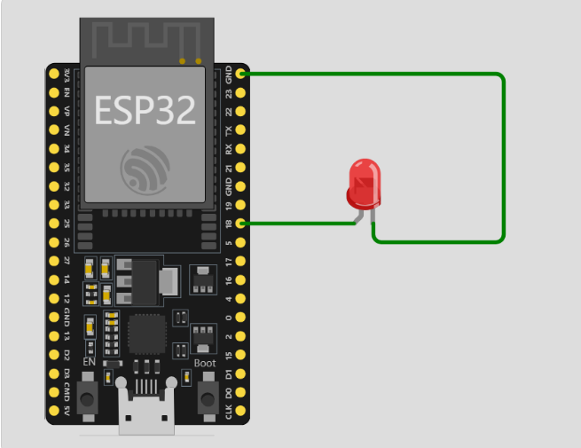

# GPIO控制

每一个GPIO引脚都代表了单片机可以通过这个引脚<font color=CornflowerBlue>输出一个高/低电平</font>，或者<font color=CornflowerBlue>读取一个外部电平</font>，而<font color=CornflowerBlue>不同的GPIO</font>又被赋予了其他<font color=CornflowerBlue>不同的附加功能</font>，在此章，我们只需要关注<font color=CornflowerBlue>GPIO引脚能输出一个高/低电平</font>。


## 🔗 1 . 硬件连接图



这个硬件其实就没什么好解释了，需要点亮一个灯的话，就必须<font color=CornflowerBlue>连接一个正极，一个负极</font>，上述我们已经提到：<font color=CornflowerBlue>GPIO可以输出高/低电平</font>，此时将LED小灯的负极固定接地（GND），如果<font color=CornflowerBlue>GPIO输出高电平</font>，此时就会产生电流，点亮LED小灯，如果<font color=CornflowerBlue>GPIO输出低电平</font>，此时两端GPIO18和GND电压一样，就不会产生电流，小灯就不会亮

<font color=Crimson>附加解释</font>：在电路中，最重要的3个因素就是：<font color=Crimson>电压</font>，<font color=Crimson>电流</font>，<font color=Crimson>电阻</font>。

###  <font color=Crimson>什么是电压和电流？</font> 
> 电压可以理解为一个大水库，电流可以理解为水库内的水。那用电器呢（也就是我们这里的LED小灯，也可以是其他用电的设备）就是在水库里面的一个水车，如果我们想要这个水车能被水流冲击动起来，那这个水是不是要有一个高低差，有高低差才能水流，对应到电流上就是，电压有高低，才能形成电流的流动


> [!CAUTION] 注意：
> 这里的高低电位差是一个相对概念，只是谁相对于谁而言，0v一定是低电位吗？不是的！它比-1V高，220V一定是高电位吗？不是的他比330V低

### <font color=Crimson>那什么是电阻呢？</font> 
> 电阻的理解也可以结合上面的，电阻可以先简单的理解为：对电流的阻碍。就像上面说的，有水位差才能带动风车转起来，但是如果水位差太大了，水流太急太猛了就容易给风车转冒烟，那为了风车安全，就在风车前做一个类似于电阻的东西，让他先缓冲一下水（缓冲级），让水不要那么急，在电路中，电阻也是做这个作用，如果电压过大容易把用电器烧掉，电阻可以理解为缓冲电压，减小电流


## 🧰 2 . 代码编写

> [!NOTE] Micropython 对 IO 控制的描述
> https://docs.micropython.org/en/latest/esp32/quickref.html#pins-and-gpio

```python
# 第一步就是导包，导入相关的函数
from machine import Pin  # 还是挺好记的，从机器内导入一个Pin的包，Pin就是引脚的意思
import time # 时间相关的包，这个同python用法差不多

if __name__ =='__main__': # 程序入口。主要是为了后面多线程编程，平时也应注意配置入口函数。
    
    # 如果要操作一个引脚，肯定是要创建一个实例化对象，对实例化对象进行操作（这部分是python基础）
    # 第一个是设置这个引脚对应开发板的是那个GPIO脚，第二个参数设置这个引脚做输出还是做输入
    PIN3 = Pin(18,Pin.OUT) # 我接在了GPIO18上，因为要控制灯，我配置成输出引脚
    
    # 这里实现一个间隔 1s 灯亮一次
    while 1:
        PIN3.on() # on打开的意思嘛，就是让这个引脚打开成高电平 // [!code highlight:3]
        time.sleep(1) # 延时
        PIN3.off() # 同理
        time.sleep(1) # 延时
        

# 这里设置成 while，就是让这个代码一直执行而不是闪一下就不整了
```


## 📥 3 . 烧录（下载）到设备


> [!CAUTION]
> 想要结束或者修改了代码想要保存的时候，都应该先停止设备，然后再进行操作，不然设备会一直处于运行占用状态，没空理会你的操作请求！


## 💡 4 . 拓展学习

学习单片机来说，点亮LED灯可以说是硬件开发界的 Hello world，上述也已经实现了点亮LED小灯的过程

### 任务要求

> **设计一个 跑马灯** 


### 效果演示


### 参考代码
<Linkcard url="https://github.com/Aqiuseven/esp32-code/blob/main/%E5%8D%95%E7%89%87%E6%9C%BA%E5%9F%BA%E7%A1%80/IO%E6%8E%A7%E5%88%B6/LiuShui.py" title="ESP32 -> IO控制 -> 流水灯"  logo="https://s21.ax1x.com/2024/11/25/pAhriuV.png"/>
<Linkcard url="https://gitee.com/tenseven/esp32-code/blob/main/%E5%8D%95%E7%89%87%E6%9C%BA%E5%9F%BA%E7%A1%80/IO%E6%8E%A7%E5%88%B6/LiuShui.py" title="ESP32 -> IO控制 -> 流水灯"  logo="https://s21.ax1x.com/2024/11/25/pAhDvNQ.png"/>
