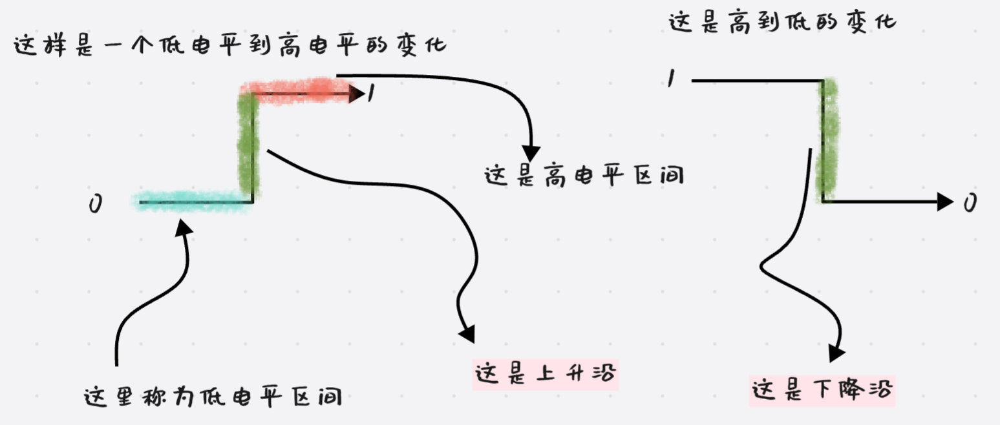
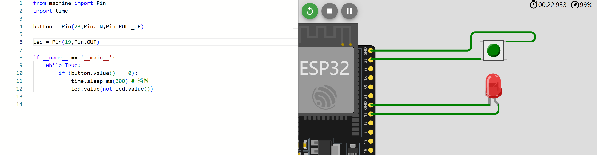
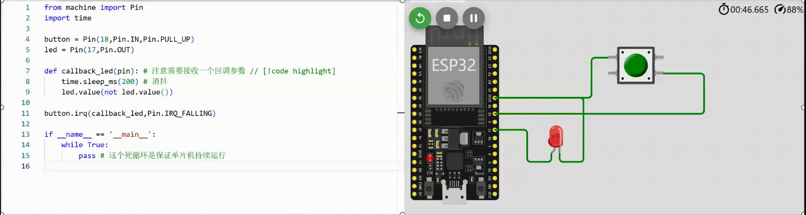

# 外部中断

## 提要

### 前置知识提要
在介绍外部中断前，需要介绍一些电平，电压边沿的概念




### 场景提要

如果我想要通过一个开关来控制一个LED灯的开关，例如实现一个家里灯的开关，那在micropython中，应该怎么实现呢？

这是我简要写的一个代码：



这个实现的功能十分简单，硬件启动后，就开始循环检测按钮是否被按下了，如果被按下的话，就让LED灯的状态取反一次。


## 上拉（下拉）电阻

在解决上述问题前，我们先来分析一下上面的代码，我现在将他贴到下方来：
```python
from machine import Pin
import time

button = Pin(21,Pin.IN,Pin.PULL_UP) #  [!code focus]

led = Pin(17,Pin.OUT)

if __name__ == '__main__':
    while True:
        if (button.value() == 0):
            time.sleep_ms(200) # 消抖
            led.value(not led.value())
```

可以看到，有一行代码是被突出显示，在前面第三章提到的GPIO控制里，只提到了前两个参数，并没有提到第三个参数`Pin.PULL_UP`的作用。

我们先来了解一下第三个参数可以填入什么：


1. `Pin.PULL_UP` ： 接入一个上拉电阻 ，通俗的解释来说就是，让一个输出端口保持在高电平，<font color=LightSlateGray>ESP32端口的高电平大致在3.5v左右</font>
2. `Pin.PULL_DOWN` : 接入一个下拉电阻，这个就是让输出端口保持在低电平
3. `Pin.PULL_HOLD` : 这个的作用是在低功耗状态时，仍然保持端口电压。<font color=LightSlateGray>具体作用会在后续内容内提及</font>

具体上拉和下拉电阻的作用可以参考这个两个视频

### 上拉电阻

<iframe 
style="width:100%; aspect-ratio:16/9; margin-top: 2em;" 
src="//player.bilibili.com/player.html?bvid=BV1W34y1579U&autoplay=0" 
frameborder="0" 
allow="accelerometer; clipboard-write; encrypted-media; gyroscope; picture-in-picture; web-share" 
allowfullscreen>
</iframe>


### 下拉电阻

<iframe 
style="width:100%; aspect-ratio:16/9; margin-top: 2em;" 
src="//player.bilibili.com/player.html?bvid=BV1ZU4y1Q7eo&autoplay=0" 
frameborder="0" 
allow="accelerometer; clipboard-write; encrypted-media; gyroscope; picture-in-picture; web-share" 
allowfullscreen>
</iframe>


> [!CAUTION] 注意
>
> ESP32 配置的 上下拉电阻，不需要通过外部电路实现，当你在初始化IO口时，配置了上拉或者下拉电阻后，<mark><span style="border-bottom:2px dashed red;">ESP32会通过内部电路来配置上拉或者下拉电阻</span></mark>，当配置完上拉/下拉电阻后，在不外接其他电路时，你可以通过万用表直流电压档，测量端口对地（GND）电压，相信你会有更好的理解。


## 分析

上面我们是通过主线程循环读取按键端口来控制灯的亮灭，<font color=Crimson>但是</font>，还记得吗？在上一章我们提到，<font color=Crimson>在多线程时，不能让单个进程任务始终占用cpu资源</font>，但是如果不在主循环里循环读取led的状态，怎么能知道用户是否按下了按钮呢？


## 外部中断

单片机除了提供定时中断外，还提供了一种中断：`外部中断`，就字面来理解就是：<span style="border-bottom:2px dashed red;">通过外部事件触发的中断程序</span>，还记得我们是怎么定义中断的吗？当单片机发生中断时，单片机会停止当前事务，优先响应中断事件，也就是说<font color=Crimson>中断事件有最高优先级</font>，据此，是不是可以通过外部中断的触发来改变灯的状态呢？

> [!CAUTION] 注意
>
> 无论是外部中断还是定时中断，他们都是高优先级事务，就如我们说的，单片机会停止主线程执行的任务，来响应中断事件，如果中断函数内执行复杂任务或者耗时任务的话，很可能会导致主线程发生错误。所以中断的函数应该**简洁**、**简单**。


想要编写一段外部中断，我们就要先了解外部中断的触发条件有哪些，在本篇的开头，我们就提到了上升/下降边沿，和高低电平的概念，单片机能接收到外部信号无非就是电平电压的变化，总结而言，外部中断触发条件有：

- `下降沿` ： 对应触发条件为 `Pin.IRQ_FALLING`
- `上升沿` ： 对应触发条件为 `Pin.IRQ_RISING`
- `低电平` ： 对应触发条件为`Pin.IRQ_LOW_LEVEL`
- `高电平` ： 对应触发条件为`Pin.IRQ_HIGH_LEVEL`


### 外部中断实现

0️⃣. 导包，Micropython中端口的外部中断是machine库下 `Pin`类内的一个子函数`irq()`

```python
from machine import Pin
```

1️⃣ . 要使用引脚的外部中断，那肯定是要配置引脚了，在配置时你要想清楚，除了配置成输入引脚外，要不要配置上（下）拉电阻，如果要配置的话应该怎么配置，这里我是配置成了上拉电阻，可以想想为什么要配置成上拉电阻

```python
button = Pin(18,Pin.OUT,Pin.PULL_UP)
```

2️⃣ . 之后你要配置中断的触发条件，中断触发后应该去执行哪个函数

> 中断绑定函数为 machine.Pin.irq()，函数原型如下
>
> ```python
> Pin.irq(handler=None, trigger=Pin.IRQ_FALLING | Pin.IRQ_RISING, *, priority=1, wake=None, hard=False)
> ```
>
> - **handler** : 中断回调函数，就是中断触发后调用谁
> - **trigger** ： 中断的触发条件
> - 其他参数会在后续的内容内提及

```python
button.irq(callback_led,Pin.IRQ_FALLING)  # 配置为下降沿触发，回调函数为 callback_led
```

<details>
  <summary>为什么要配置上拉电阻，【答案】</summary>
	中断的触发的条件是下降沿触发，也就是说单片机的端口在默认的时候必须保持高电平，只有当我按下按钮的时候，它才变成低电平，此时才会出现下降沿的电平，中断才会被触发，前述视频已经讲解，需要端口保持高电平，需要接入一个上拉电阻，这也就是为什么这里需要接入一个上拉电阻的原因了。
</details>


3️⃣ . 完整代码

```python
from machine import Pin
import time

button = Pin(18,Pin.IN,Pin.PULL_UP)
led = Pin(17,Pin.OUT)

def callback_led(pin): # 注意需要接收一个回调参数 // [!code highlight]
    time.sleep_ms(200) # 消抖
    led.value(not led.value())

button.irq(callback_led,Pin.IRQ_FALLING)

if __name__ == '__main__':
    while True:
        pass # 这个死循环是保证单片机持续运行
```

::: tip 提示 

你可能注意到了中断函数里面有一个延迟函数，为什么需要一个延迟函数呢？

实物按钮中，机械按钮不可能实现理想的按动效果，说人话就是，按钮按下去之后可能会有回弹（类似于按动弹簧），导致触发多次中断，这里就是让他延迟一下，等他稳定了不弹了，再执行代码。

:::


### 最终实验效果


