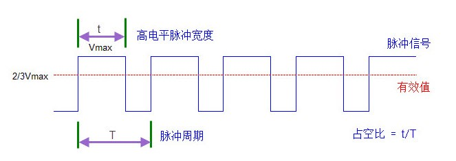
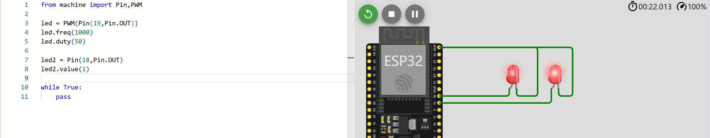
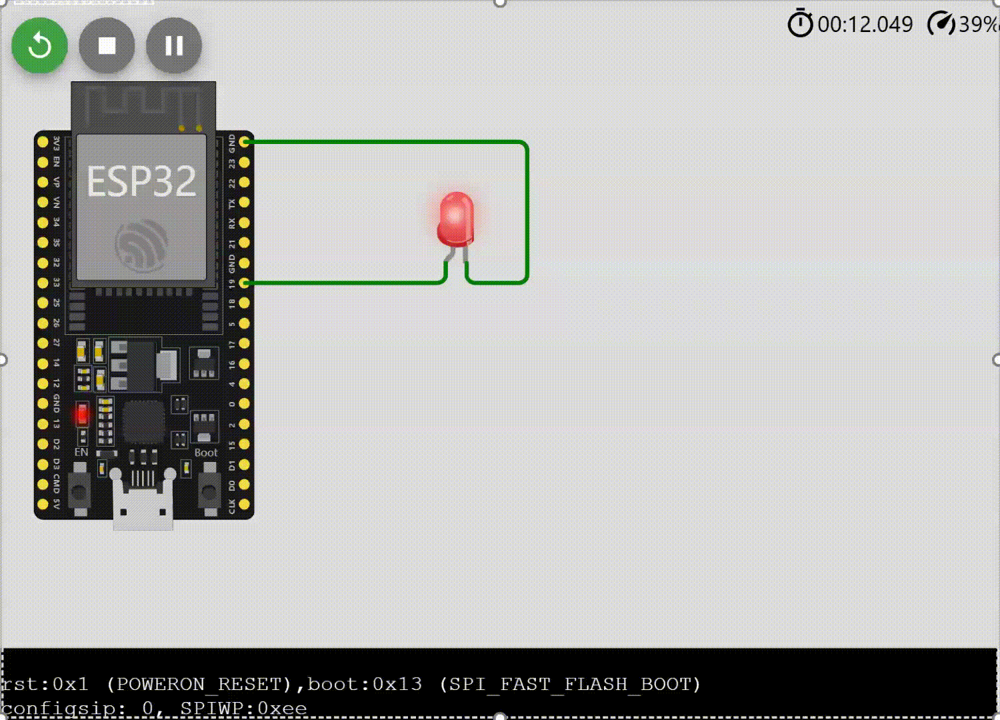

# PWM

## 介绍

pwm（Pulse Width Modulation）脉冲宽度调制技术，名字可能有点唬人，但是本质的功能就是<span style="border-bottom:2px dashed red;">电压调节技术</span>，`esp32`的引脚输出大概在3.5V左右，如果我想让他的端口电压输出的小一点，就需要利用到`PWM`技术了

对PWM的介绍，多数教程都是以LED灯的形式介绍的：在前面的代码里面我们实现过灯一开一关的效果，如果开关一个灯的速度足够快，快到肉眼已经看不到关灯的时候，我们就会认为他是常量状态的，但是实际上他还是有断电的时候，所以在<span style="border-bottom:2px dashed red;">相同时间内，快速开关实现的亮灯效果，和持续供电实现的亮灯效果耗电量是不同的</span>。快速开关大致就是PWM的原理，这里可能表述的有点笼统。




比较常见的解释是这种，大致是说通过调节高电平（开）和低电平（关）的占比时间，可以改变输出电压的有效值

> 例如：输出5v电压时，一个周期中开一半的时间，关一半的时间，即：占空比(高电平占据整个周期时间的比例)为50%时，那整个周期就相当于输出2.5v的电压。

在上述中大致提到了如下概念：

- 占空比：高电平占据整个周期时间的比例，这个值只能是：<font color=Crimson>0 - 1023</font>
- 周期 ：通常用频率来表示，所谓频率就是一秒内高低电平（开关）变化的次数，频率的倒数就是周期


## 简单来说

PWM就是<font color=Crimson>电压调节的技术，占空比越高，实际输出的电压就越大，反之越小</font>。频率就是开关变化的次数，开关越快看那个灯肯定是更丝滑和一直亮一样，电压输出的更平稳平滑，最大频率受单片机自身影响，`esp32` 的频率范围大致在 1 - 40M HZ 之间，控制LED的话大概1000hz就够了。


## 在单片机上的实现

在一些单片机上，只有部分IO口才能实现PWM功能，但是`esp-wroom-32`上的话比较特别，只要是允许输出的口，都可以配置成PWM口

0️⃣. 导包，PWM也是`machine`下的一个子函数

```python
from machine import Pin,PWM
```


1️⃣ .初始化一个PWM的输出引脚

```python
led = PWM(Pin(16,Pin.OUT))
led.freq(1000)
led.duty(512)
```

> 这里的引脚需要通过PWM来初始化，PWM的函数为：
> ```python
> machine.PWM(dest, freq, duty, duty_u16, duty_ns)
> ```
>
> **第一个参数 dest ： 一个Pin对象，就是要传入一个引脚**
>
> **第二个参数 freq ： 设置一秒开关的频率，单位HZ。这里选用的是1000  HZ**
>
> **第三个参数 duty ： 占空比，范围是 0 - 1023；**
>
> <font color=Crimson>主要配置以上 3 个参数即可</font>
>
> 后面的两个就是设置更细的占空比分配了，也就是能把电压更加细分一点
>
> - duty_u16 占空比，范围是 0 - 65535，2 的 16 次方；
> - duty_ns 以纳秒为单位设置脉冲宽度，范围是 0 - 50000。

:::info

完整PWM的使用可以参考：http://www.86x.org/en/latet/library/machine.PWM.html#machine-pwm

:::

2️⃣ . 关闭pwm输出

```python
pwm.deinit()
```


3️⃣ . 完整代码

```python
from machine import Pin,PWM

led = PWM(Pin(19,Pin.OUT))
led.freq(1000)
led.duty(50)

led2 = Pin(18,Pin.OUT)
led2.value(1)

while True:
    pass
```



我在此处配置了两个灯，可以明显看到，PWM控制的（左边的灯）亮度明显要低于右边普通输出的灯。如果你手头有万用表，也可以测量IO口对地(GND)的电压，自己动手试试，可能回更好的理解 PWM 技术


## 💡拓展学习

### 任务要求
呼吸灯大家肯定是见怪不怪的了，其原理也是PWM，只不过是不断的改变占空比来实现呼吸灯的效果。本部分的自主学习就是设计一个呼吸灯效果

### 效果演示



ps ： 仿真效果可能不是很明显，实物循环变化的话会有比较明显的感觉


### 提交批改：

后续开放
